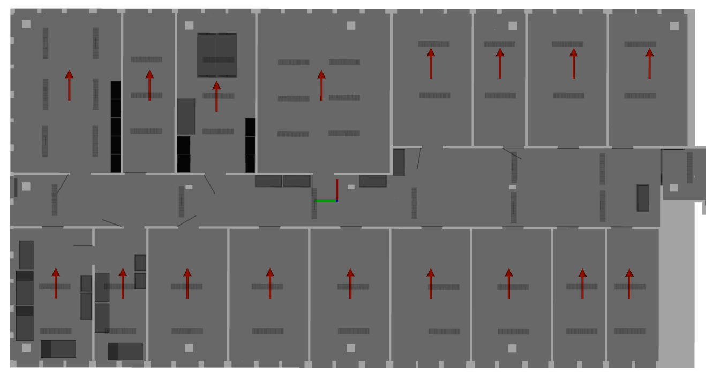

# micp_convergence

## Cube Grid

## AVZ

Wall thickness:
- supporting wall: 22.8cm
- normal wall: 14.0cm

Pose format: `[x, y, z, roll, pitch, yaw]` or `[x, y, z, qx, qy, qz, qw]`.
```
sensor_poses:
  - [5.5,  -14.0, 0.5, 0.0, 0.0, 0.0] # 0 (top - right)
  - [5.5,  -10.6, 0.5, 0.0, 0.0, 0.0] # 1 (top)
  - [5.5,   -7.3, 0.5, 0.0, 0.0, 0.0] # 2
  - [5.5,   -4.2, 0.5, 0.0, 0.0, 0.0] # 3
  - [4.5,    0.7, 0.5, 0.0, 0.0, 0.0] # 4
  - [4.0,    5.4, 0.5, 0.0, 0.0, 0.0] # 5
  - [4.5,    8.4, 0.5, 0.0, 0.0, 0.0] # 6
  - [4.5,   12.0, 0.5, 0.0, 0.0, 0.0] # 7 (top - left)
  - [-4.4,  12.6, 0.5, 0.0, 0.0, 0.0] # 8 (bottom - left)
  - [-4.4,   9.6, 0.5, 0.0, 0.0, 0.0] # 9
  - [-4.4,   6.7, 0.5, 0.0, 0.0, 0.0] # 10
  - [-4.4,   3.0, 0.5, 0.0, 0.0, 0.0] # 11
  - [-4.4,  -0.6, 0.5, 0.0, 0.0, 0.0] # 12
  - [-4.4,  -4.2, 0.5, 0.0, 0.0, 0.0] # 13
  - [-4.4,  -7.7, 0.5, 0.0, 0.0, 0.0] # 14
  - [-4.4, -11.0, 0.5, 0.0, 0.0, 0.0] # 16
  - [-4.4, -13.1, 0.5, 0.0, 0.0, 0.0] # 17 (bottom - right)
```

