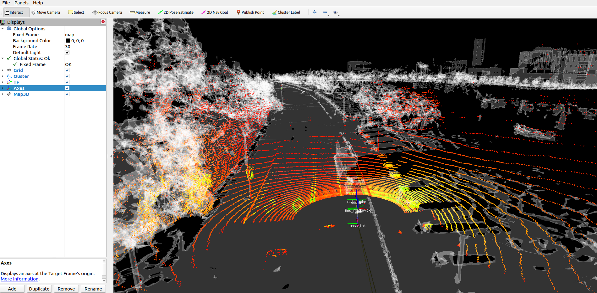

# micp_mulran

MICP-L usage and evaluation on Mulran datasets. This is a ROS-package but does not neccesarily needs to be placed into a ROS-workspace since it only contains launch files to be executed.

For each Mulran environment (DCC, KAIST, Riverside, Sejong City) we reconstructed one mesh map using lvr2:

|     Sequence       |   Map     |
|:-------------:|:---------------:|
| DCC | `mulran_dcc03_mesh_lvr2.ply`  |
| KAIST | `mulran_kaist02_mesh_lvr2.ply` |
| Riverside | TODO |
| Sejong City | TODO |

## Results as Bag-Files

We added the resulting localization as tf-frame into newly recorded Bag-Files.

The Bag-Files are available for internals at Rab `datasets/mulran/micp_mulran`

## Reproduction of the results

In this section, we give an overview of how the resulting Bag-Files can be reproduced by anyone.

We used a desktop pc with the following specifications:
- Ubuntu 20, ROS noetic
- Ryzen 7 3800X
- Rmagine Version (v2.1.0) - Only the Embree (CPU) backend is used
- RMCL (v1.1.2)
- (optional) For visualizations: rmagine_ros + old mesh_tools version

The reproduction of the resulting Bag-File can be done by executing the respective launch-files in this repository. Each launch-file requires two files: a Bag-File for sensor data and a Mesh-Map-file as map for MICP-L.

### Internal

All required files are stored on the Rab-fileserver at the base-path "datasets/mulran".

Prepare the data by doing the following steps:
1. Download a Mulran bag file from Rab "mulran/bags".
2. Download a mesh map from Rab "micp_mulran".
3. Change pathes in launch files, so that they are pointing to the right files


### External

TODO


### Launching - Inspection

To inspect that everything went fine, execute:

```console
roslaunch micp_mulran micp_mulran_dcc01.launch gui:=true
```

A RViz window is opening. Execute `rosnode kill /mesh_publisher` in another terminal as soon as the mesh gets visible in RViz.



### Launching - Recording

Execute a launch file without GUI (RViz):

```console
roslaunch micp_mulran micp_mulran_dcc01.launch
```

and pipe the results into a new Bag-File, by running `rosbag record -a` in another terminal.

The resulting Bag-File now consists of an additional transformation between `world` and `map` frame that represents the localization of the autonomous car in the loaded mesh.
